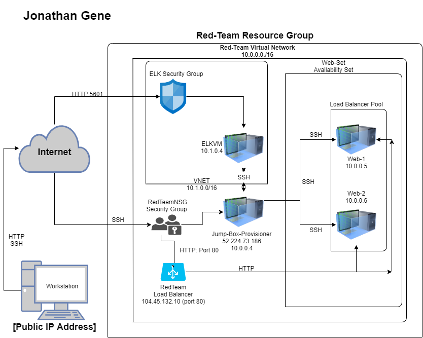
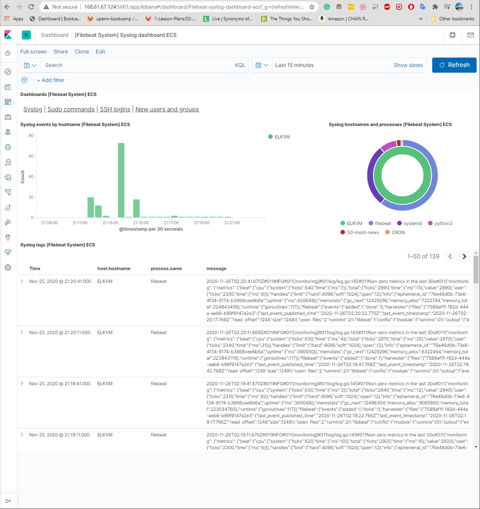
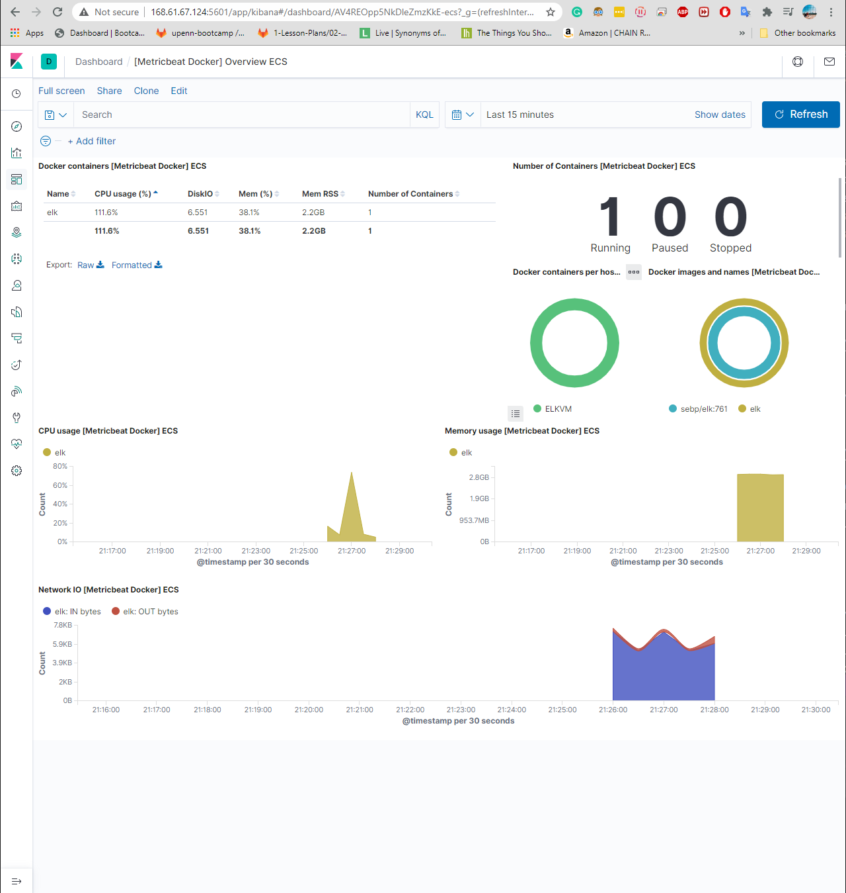

## Automated ELK Stack Deployment

The files in this repository were used to configure the network depicted below.



These files have been tested and used to generate a live ELK deployment on Azure. They can be used to either recreate the entire deployment pictured above. Alternatively, select portions of the [install-elk.yml] file may be used to install only certain pieces of it, such as Filebeat.

  - [ansible/ELK/install-elk.yml]
```
---
- name: Configure Elk VM with Docker
  hosts: elk
  become: true
  tasks:

    # Use apt module
    - name: Install docker.io
      apt:
        update_cache: yes
        force_apt_get: yes
        name: docker.io
        state: present

      # Use apt module
    - name: Install python3-pip
      apt:
        force_apt_get: yes
        name: python3-pip
        state: present

      # Use pip module (It will default to pip3)
    - name: Install Docker module
      pip:
        name: docker
        state: present

      # Use command module
    - name: Increase virtual memory
      command: sysctl -w vm.max_map_count=262144

      # Use sysctl module
    - name: Use more memory
      sysctl:
        name: vm.max_map_count
        value: "262144"
        state: present
        reload: yes

      # Use docker_container module
    - name: Download and launch a docker elk container
      docker_container:
        name: elk
        image: sebp/elk:761
        state: started
        restart_policy: always
        # Please list the ports that ELK runs on
        published_ports:
          -  5601:5601
          -  9200:9200
          -  5044:5044
```
This document contains the following details:
- Description of the Topology
- Access Policies
- ELK Configuration
  - Beats in Use
  - Machines Being Monitored
- How to Use the Ansible Build


### Description of the Topology

The main purpose of this network is to expose a load-balanced and monitored instance of DVWA, the D*mn Vulnerable Web Application.

Load balancing ensures that the application will be highly available, in addition to restricting traffic to the network.
- What aspect of security do load balancers protect? What is the advantage of a jump box? 
 - As the we beging to progress into cloud computing. The off-loading function of a load balancer defends an organization against DDOS[Denial-of-service] attacks. The load balancer shift the attacking traffice from the corporate server to a public cloud provider.

Integrating an ELK server allows users to easily monitor the vulnerable VMs for changes to the network and system resources.
- What does Filebeat watch for? 
 Filebeat watches and collects data about the file system.
- What does Metricbeat record? 
Metricbeat records and collects operating machine metrics.

### Elastic Definition
## FileBeat
- [Filebeat is a lightweight shipper for forwarding and centralizing log data. Installed as an agent on your servers, Filebeat monitors the log files or locations that you specify, collects log events, and forwards them either to Elasticsearch or Logstash for indexing.]

##  MetricBeat
- [Metricbeat is a lightweight shipper that you can install on your servers to periodically collect metrics from the operating system and from services running on the server. Metricbeat takes the metrics and statistics that it collects and ships them to the output that you specify, such as Elasticsearch or Logstash.]


The configuration details of each machine may be found below.
_Note: Use the [Markdown Table Generator](http://www.tablesgenerator.com/markdown_tables) to add/remove values from the table_.

| Name            | Function     | IP Address             | Operating System |
|-----------------|--------------|------------------------|------------------|
| Jump-Box        | Gateway      | 10.0.0.4               | Linux            |
| Web-1           | DataBase     | 10.0.0.5               | Linux            |
| Web-2           | DataBase     | 10.0.0.6               | Linux            |
| ELKVM           | Motitoring   | 10.1.0.4               | Linux            |


### Access Policies

The machines on the internal network are not exposed to the public Internet. 

Only the Jump-Box-Provisioner machine can accept connections from the Internet. Access to this machine is only allowed from the following IP addresses:
- whitelisted IP addresses 108.36.xxx.xxx [Host_Public_IP_Address]

Machines within the network can only be accessed by Jump-Box.
- Which machine did you allow to access your ELK VM? Jump-Box-Provisioner
- What was its IP address? 
Public IP address: 52.224.73.186
Privite IP address: 10.0.0.4

A summary of the access policies in place can be found in the table below.

| Name     | Publicly | Allowed IP Addresses |
|----------|----------|----------------------|
| Jump-Box | Yes      | 52.224.73.186        |
| Web-1    | No       | 10.0.0.5             |
| Web-2    | No       | 10.0.0.6             |
| ELKVM    | NO       | 10.1.0.4             |

### Elk Configuration

Ansible was used to automate configuration of the ELK machine. No configuration was performed manually, which is advantageous because...
- What is the main advantage of automating configuration with Ansible?
Automating with Ansible allows you create consistent, reproducable results throughout multiple machine configurations.

The playbook implements the following tasks:
- _TODO: In 3-5 bullets, explain the steps of the ELK installation play. E.g., install Docker; download image; etc._
- ... install docker.IO
- ... install python.pip
- ... install docker
- ... install Docker module
- ... install virtual memory
- ... Use more memory
- ... Download and launch a docker elk container
- 5601:5601
- 9200:9200
- 5044:5044

The following screenshot displays the result of running `docker ps` after successfully configuring the ELK instance.


### Target Machines & Beats
This ELK server is configured to monitor the following machines:
- List the IP addresses of the machines you are monitoring
- Web-1 10.0.0.4
- Web-2 10.0.0.5
- ELKVM 10.1.0.4

We have installed the following Beats on these machines:
- Specify which Beats you successfully installed
- Filebeat
- MetricBeat

These Beats allow us to collect the following information from each machine:
- In 1-2 sentences, explain what kind of data each beat collects, and provide 1 example of what you expect to see. E.g., `Winlogbeat` collects Windows logs, which we use to track user logon events, etc.
[File Beat moitors the log file or locations that user specify. File beat logs will collect sever logs.][MetricBeat collects metrics and statistic.]

# Filebeat: 
Filebeat monitors the log files or locations that you specify, such as Syslogs, visualized by Kibana below.



# Metricbeat: 
Metricbeat monitors the metrics and statistics of the operating system, such as CPU usage, visualized by Kibana below.



### Using the Playbook
In order to use the playbook, you will need to have an Ansible control node already configured. Assuming you have such a control node provisioned: 


SSH into the control node and follow the steps below: 
- Copy the yml file to ansible directory.
- Update the config file to include remote users, host ip address, and published ports.
- Run the playbook, and navigate to kibana to check that the installation worked as expected.

Answer the following questions to fill in the blanks:_
- Which file is the playbook? .yml file 
- Where do you copy it? /etc/ansible, /etc/ansible/files, and /etc/ansible/roles depending on the .yml file.
- Which files do you update to make Ansible run the playbook on a specific machine? /etc/ansible/hosts and /etc/ansible/ansible.cfg.
- How do I specify which machine to install the ELK server on versus which to install Filebeat on? Editing the /etc/ansible/hosts file with the approriate IP addresses.
- Which URL do you navigate to in order to check that the ELK server is running? http://<local.host>/app/kibana#/home.
Nano into the local host file and change the webserver by removing the "##"
10.0.0.5 ansible_python_interpreter=/usr/bin/python3
10.0.0.6 ansible_python_interpreter=/usr/bin/python3
[elk]
10.1.0.4 ansible_python_interpreter=/usr/bin/python3

check this URL to check if the ELK server is running. http://13.hostIP:5601/app/kibana#/home

_As a **Bonus**, provide the specific commands the user will need to run to download the playbook, update the files, etc._
ansible-playbook[name_of_yml.ym] file.
